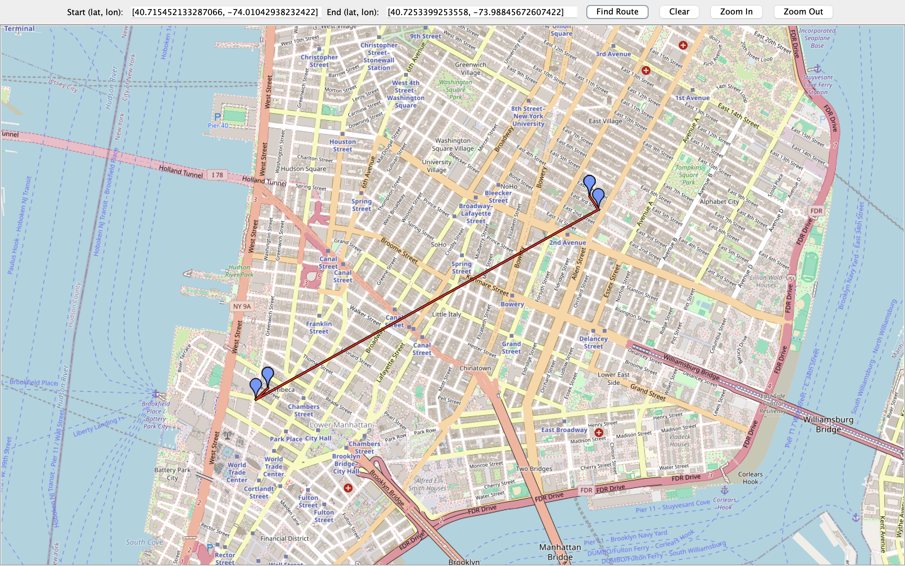

# Citi Bike Route Finder
The CitiBike Route Finder is a Java desktop application designed to help users find routes 
and nearby stations with available bikes or slots. By selecting a start and end location on 
an interactive map, the application displays the optimal route along with the closest stations.
It uses OpenStreetMap for map rendering and integrates with a backend API (AWS Lambda) to fetch 
real-time routes and station availability.

